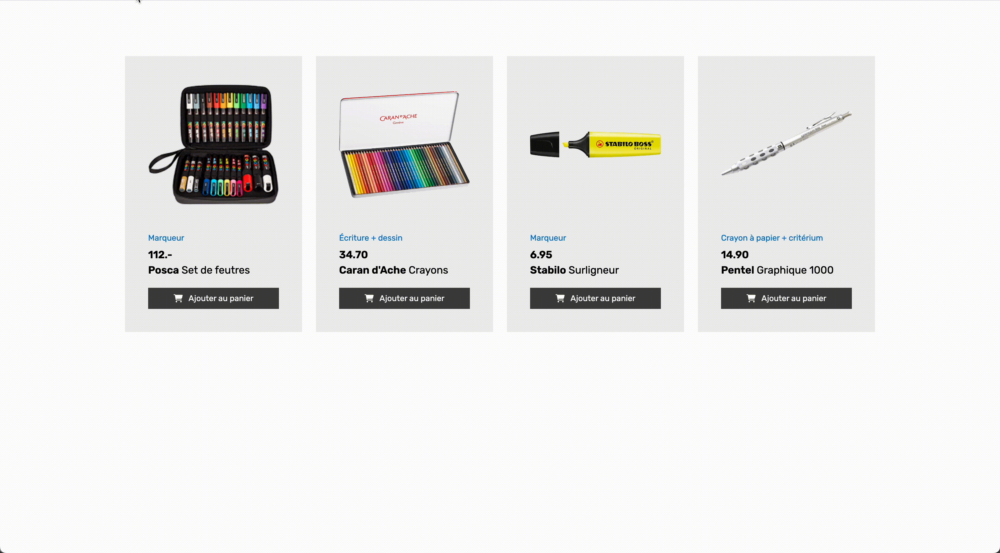

# Exercice JavaScript 2

## Installation

1. Cloner le repository
2. Ouvrir le dossier avec Visual Studio Code
3. Ouvrir une fenêtre de terminal dans Visual Studio Code et entrer la commande suivante :

```bash
npm install
```

## Travail

Depuis le terminal, entrer la commande suivante :

```bash
npm run dev
```

## Consigne

Faire en sorte que le message de confirmation apparaisse lorsqu'on ajoute un produit au panier, en suivant les étapes suivantes :

1. Créer une variable contenant tous les boutons "Ajouter au panier", et une variable contenant l'élément de la confirmation.
2. Faire une boucle avec les boutons "Ajouter au panier". Lorsqu'on clique sur un bouton, appeler une fonction.
3. Dans cette fonction, faire en sorte que la confirmation devienne visible (la classe existe déjà dans la CSS).
4. Après 2 secondes, cacher le message de confirmation. Pour cela, utiliser _setTimeout_ (vous pouvez faire une petite recherche sur internet).

## Aperçu du résultat


